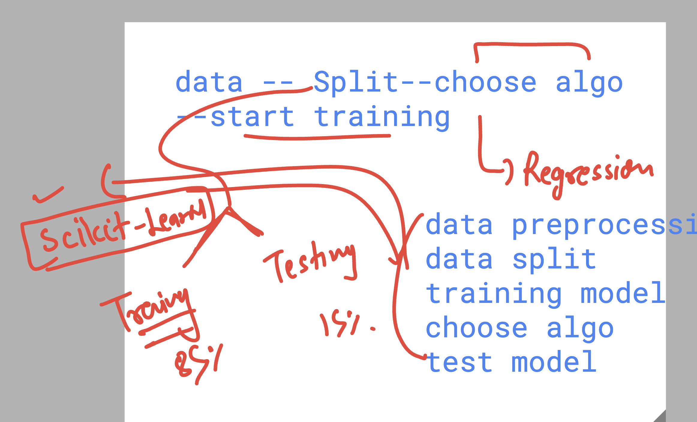
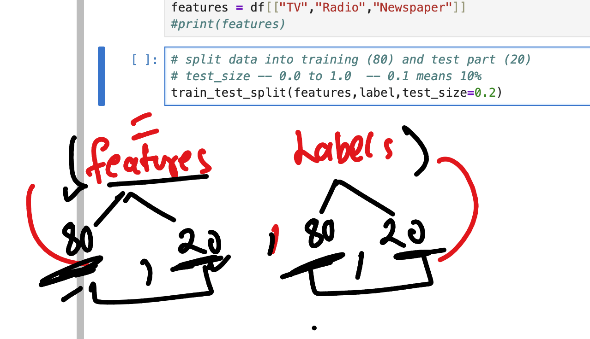

## Basic Mindset of ML 


### General machine learning Model Training process at high 


### machine learning options / category understanding 


### Data in Supervised ML will be 


## Understanding classification and regression in ML(supervised category)


## Final ML details 


### data understanding before we try to Train to Algo 


### Creating virtual environment 

```
learntechbyme@ml-instance:~$ python3 -m venv  ashu-env 
learntechbyme@ml-instance:~$ ls
Untitled.ipynb  jupyterhub-proxy.pid  jupyterhub_config.py       jupyterhub_cookie_secret
ashu-env        jupyterhub.sqlite     jupyterhub_config.py.back  usgs-work
learntechbyme@ml-instance:~$ 
```

### switching to your virtual env

```
learntechbyme@ml-instance:~$ source  ashu-env/bin/activate
(ashu-env) learntechbyme@ml-instance:~$ 

# Installing pandas and other libraries 

pip install  numpy pandas matplotlib seaborn 
```

### For ML implementation purpose -- scikit-learn is default choice

```
pip install  numpy pandas matplotlib seaborn  scikit-learn 
Requirement already satisfied: numpy in ./ashu-env/lib/python3.8/site-packages (1.24.4)
Requirement already satisfied: pandas in ./ashu-env/lib/python3.8/site-packages (2.0.3)
Requirement already satisfied: matplotlib in ./ashu-env/lib/python3.8/site-packages (3.7.5)
Requirement already satisfied: seaborn in ./ashu-env/lib/python3.8/site-packages (0.13.2)
Collecting scikit-learn
  Downloading scikit_learn-1.3.2-cp38-cp38-manylinux_2_17_x86_64.manylinux2014_x86_64.whl (11.1 MB)
     |████████████████████████████████| 11.1 MB 25.4 MB/s 
Requirement already satisfied: pytz>=2020.1 in ./ashu-env/lib/python3.8/site-packages (from pandas) (2025.2)
Requirement already satisfied: tzdata>=2022.1 in ./ashu-env/lib/python3.8/site-packages (from pandas) (2025.2)
Requirement already satisfied: python-dateutil>=2.8.2 in ./ashu-env/lib/python3.8/site-packages (from pa

```

### Info about scikit-learn 



### outcome of train_test_split in scikit-learn 
